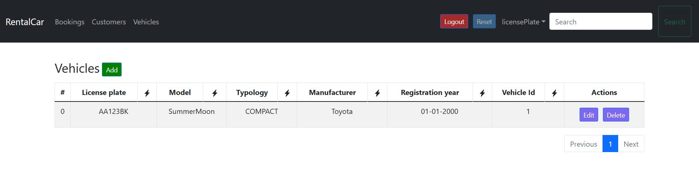

# React RentalCar

Front-end React project of a simple rental car application.

## Table of Contents

 - [General Info](#general-info)
 - [Introduction](#introduction)
 - [Technologies](#technologies)
 - [Setup](#setup)
 - [Illustrations](#illustrations)
 - [Functionalities](#functionalities)
 - [Links](#-links)
 

## General Info

A front-end project of an application that allowed users to rent a car for a specific period of time. Some users are 'SUPERUSER' and they are the admin. They can insert, update, delete each data in the database.
## Introduction

The goal of this project is to learn how [React](https://it.reactjs.org/) works. There is a login page, a page for the vehicles, a page for the customers and a page for the bookings and each of them are represented by a dynamic table. It can be sorted, filtered and the user can search whatever data they need. An header will guide the user through all the possible actions.
## Technologies
- React 17.0.2
## Setup

When you'll lunch the application, there is no data because you have to lunch firstly the back-end. Read here to setup it: [Back-end RentalCar](https://github.com/LVisir/spring-rental-car#readme) (it takes just a few minutes). After the back-end is running, just clone this repo, execute ```yarn install``` and run ```npm run start```, wait a few seconds, and the page will appear in the browser in localhost:3000.
## Illustrations

A brief overview of a page of an entity:


## Functionalities

The ```src/components/table/CustomTable.js``` is the generic dynamic table in which all the data will adapt to. 

Each page cannot be accessible if there isn't the jwt token in the header of the http message requesting the page (read more in [Back-end RentalCar](https://github.com/LVisir/spring-rental-car#readme)). For each request the email and the password of the user in the current session are mixed with a secret key that generate the token. If the email and the password exists in the db, the token will be generated and saved inside the session storage.

To have more data to work with, there is some files with 'db' in the file name, for example in ```db.json``` or ```new-db.json```, that you can use to load the data in the MySQL database by just importing the json as tables.

The core of this project is all inside ```src/components/``` which have all the element needed for the app.
## 🔗 Links
[](https://github.com/LVisir)
[](https://www.linkedin.com/in/edoardo-mariani-2903a5262/)

